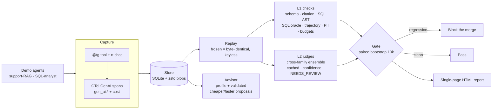

# TraceGym

**Record → replay → score → gate.** An OpenTelemetry-native evaluation and
regression harness for AI agents. Capture an agent once, replay it
deterministically with **zero API keys**, score it with layered deterministic
checks and a calibrated LLM-judge ensemble, and block regressions in CI, at **$0**.

[](https://github.com/hoomanesteki/tracegym-ai-agent-evaluation/actions/workflows/ci.yml)
[](https://github.com/hoomanesteki/tracegym-ai-agent-evaluation/actions/workflows/eval-gate.yml)
[](https://www.python.org)
[](LICENSE)

Agent demos are easy. Agent regressions are silent: a prompt tweak drops a
citation, a retriever change breaks grounding, a model swap triples cost, and
nobody notices until production. TraceGym is the missing CI layer that catches
these before they merge.

## Try it in 30 seconds, no API keys

```bash
uvx --from git+https://github.com/hoomanesteki/tracegym-ai-agent-evaluation tracegym demo
```

It builds a self-contained workspace, replays 32 golden cases across three suites
offline, scores them, blocks a set of seeded regressions, and opens an HTML
report. Nothing leaves your machine.

## Results

Every number below is measured by the demo on your machine, not asserted.

| Metric | Value |
| --- | --- |
| Replay determinism (repeated frozen runs, byte-identical) | **100%** |
| Seeded regressions caught by the gate | **10 / 10** |
| Golden cases across three suites | **32** |
| Uncertain judge verdicts routed to human review | yes, when the judges disagree |
| API spend to build and run | **$0.00** |
| Judge-vs-human Cohen's κ | pending your labels (the demo ships the protocol and a canary drift check) |

## How it works



1. **Capture.** An OpenAI-compatible proxy, a `@tg.tool` decorator, and a real
   OpenTelemetry `SpanExporter` emit GenAI-semconv spans (`gen_ai.provider.name`,
   token usage, and a namespaced cost) into SQLite. Tool and LLM I/O are pinned
   as content-addressed fixtures.
2. **Replay.** `frozen` mode replays those fixtures with no network and no keys,
   byte-identically. It refuses to run without recorded fixtures rather than
   fabricate an answer.
3. **Score.** L1 deterministic checks (schema, citation/grounding, a hardened SQL
   AST guard, a SQL execution-accuracy oracle, tool-selection, trajectory, PII,
   cost and latency budgets). L2 is a cross-family LLM-judge ensemble, cached by
   `(case, output, rubric, model)`, that reports its own confidence and returns
   **NEEDS_REVIEW** instead of a forced verdict when the judges disagree.
4. **Gate.** A paired bootstrap over per-case deltas blocks a merge only on
   high-confidence signals: a new invariant failure, a mean score drop whose 95%
   CI stays below zero, or a cost regression. Uncertain wobbles warn, not block.
5. **Advise.** The efficiency advisor profiles cost, tokens, and latency, then
   proposes cheaper or faster configurations and marks one **SAFE** only after a
   deterministic replay proves quality did not regress.

## An agentic-evaluation harness

- **Custom benchmarks** for agents, scored on task completion, tool-selection
  correctness, tool-call efficiency, context fidelity, and trajectory validity,
  under cost and latency budgets.
- **Benchmark an agent against a reference**, a prior version, an alternate
  model, or a deterministic domain solver. The SQL analyst is graded by execution
  accuracy against a gold query run over the bundled database.
- **MCP-aware.** MCP tool calls are captured, replayed, and scored like any tool.
  **Multi-agent-ready** through nested agent spans.
- **OpenTelemetry-native** and wire-format compatible: emit `gen_ai.*` spans, or
  ingest them from any OTel SDK through the SQLite exporter.
- **Statistical rigor:** paired-bootstrap significance, Cohen's κ reported with
  raw agreement and PABAK, and a pre-decided calibration ladder that demotes the
  judge to advisory rather than fake a number.

## Use it on your own agent

```bash
uv add "git+https://github.com/hoomanesteki/tracegym-ai-agent-evaluation"
tg record --proxy --port 8080     # point your agent's base_url here, run it once
tg gate --vs baseline             # exit 1 on a regression, wire into CI
tg advise                         # validated cheaper/faster suggestions
tg report                         # open the HTML report
```

The command is `tg` (or its alias `tracegym`).

The CI recipe is [.github/workflows/eval-gate.yml](.github/workflows/eval-gate.yml):
it replays the suites and blocks the merge with **no secrets configured**.

## The seeded regressions

A pre-registered set of ten realistic bugs (dropped citation, skipped PII scrub,
wrong retrieval, a destructive SQL `DELETE`, a dropped `GROUP BY`, a `PRAGMA`
instead of a `SELECT`, and more) is applied as output transforms on the baseline
agents, so each is a real behavior change that replays from the same fixtures. The
gate catches **10 of 10**. The list lives in
[tracegym/demos/bugs.py](tracegym/demos/bugs.py), in git history, which is the
answer to "you cherry-picked the bugs".

## See the actual data

The report is not just numbers. It has a **regression gallery** (baseline vs
buggy output and the exact check that caught each bug) and a **per-case
drill-down** (the input, the agent's real output, every check with its detail, the
judge, and the trace). The same data is on the CLI:

```bash
tg cases                 # every case with score, judge state, invariant fails
tg show sql-001          # one case in full: input, SQL, checks, judge, trace
tg diff sql_delete       # a seeded bug: baseline vs buggy + the check that caught it
```

## What it doesn't do (yet)

- The judge scores text only. Rewards are execution and deterministic checks; the
  judge grades phrasing, and its agreement with a human is measured, not assumed.
- Frozen replay is the determinism contract. `live` mode inherits provider
  nondeterminism and is labeled variance-expected.
- Streaming is rejected by design (the proxy returns 400). Deterministic replay of
  token streams is a later problem.
- The bundled demo uses deterministic stand-in agents and a local judge so it runs
  at $0. A real Cohen's κ needs your human labels against a live cross-family
  judge. Python only, no hosted UI.

## Install

Until the PyPI release is published, install from git:

```bash
uv add "git+https://github.com/hoomanesteki/tracegym-ai-agent-evaluation"
```

Once it is on PyPI:

```bash
uv add tracegym                 # core (keyless demo, checks, gate, report)
uv add "tracegym[proxy]"        # + the capture proxy
uv add "tracegym[judges]"       # + live Gemini / Groq judges
uv add "tracegym[mlflow]"       # + optional MLflow eval-run tracking
```

## License and citation

MIT. `CITATION.cff` is included. Contributions welcome, see the open issues.
